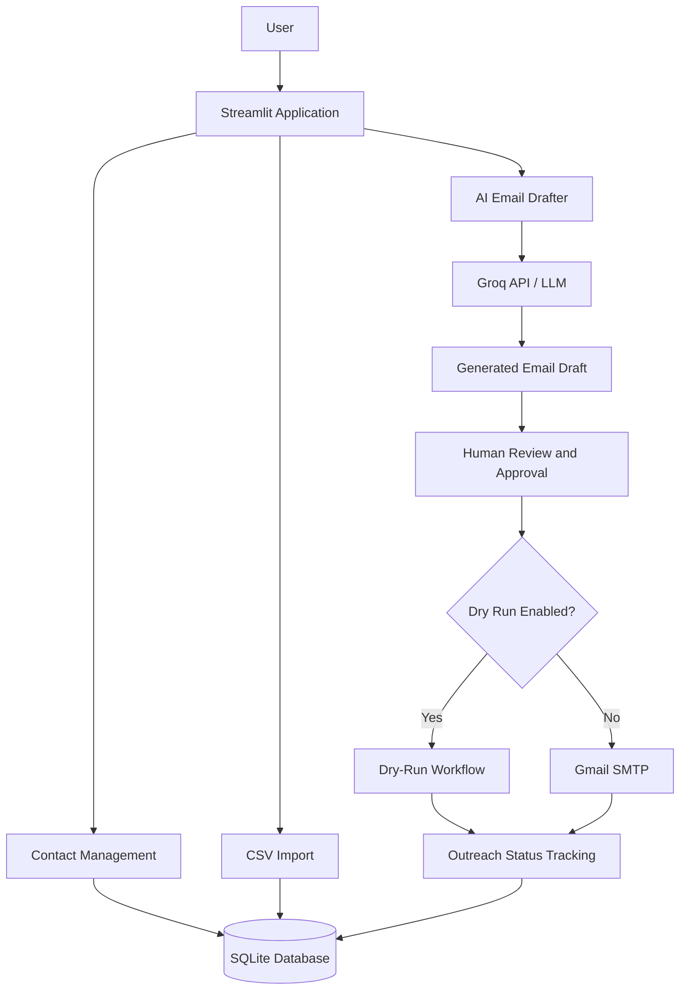

# 📈 IB Networking CRM — AI-Powered Investment Banking Outreach

<p align="center">
  <strong>A Student-Friendly CRM for Smarter Professional Networking</strong>
  <br />
  AI-Assisted Email Drafting • Contact Management • Human Approval • Gmail Integration
</p>

<p align="center">
  
  
  
  
  
  
</p>

IB Networking CRM is a Python-based CRM application designed to help students organize professional contacts, draft personalized networking emails with AI, review and approve messages, and manage their outreach workflow from one dashboard.

Built using **Python, Streamlit, SQLite, Groq, and Gmail SMTP**, this project focuses on making networking more organized while keeping users in control of outgoing communication.

---

## 🎬 Live Project Demo

Watch the application workflow, including contact management, AI-assisted email drafting, approval, and CSV import.

<p align="center">
  
</p>

**Demo highlights**

* 📊 CRM dashboard and outreach pipeline
* 👥 Contact management
* 🤖 AI-assisted networking email drafting
* ✅ Review and approval workflow
* 📧 Email sending workflow and dry-run testing
* 📂 CSV contact import

> The demo GIF is stored at `docs/demo.gif`. Make sure the filename and path match the actual file in your repository.

---

## 📑 Table of Contents

* [Overview](#-overview)
* [Problem Statement](#-problem-statement)
* [Key Features](#-key-features)
* [System Architecture](#️-system-architecture)
* [Technology Stack](#️-technology-stack)
* [Getting Started](#-getting-started)
* [Environment Configuration](#️-environment-configuration)
* [How to Use](#-how-to-use)
* [Project Structure](#-project-structure)
* [Security and Responsible Outreach](#-security-and-responsible-outreach)
* [Current Limitations](#️-current-limitations)
* [Roadmap](#️-roadmap)
* [AI Engineering Concepts](#-ai-engineering-concepts)
* [Interview Talking Points](#-interview-talking-points)
* [Contributing](#-contributing)
* [License](#-license)
* [Connect](#-connect)

---

## 🎯 Overview

Professional networking is an important part of building a career in investment banking, finance, consulting, and other competitive industries.

However, organizing contacts, writing personalized emails, and tracking outreach can become repetitive and difficult to manage using spreadsheets alone.

IB Networking CRM brings these activities into a single application. Users can maintain contact records, import contacts from CSV, generate email drafts using an LLM, review messages, and manage outreach statuses.

### Project objectives

* Simplify contact management for students.
* Reduce repetitive email-writing effort through AI assistance.
* Keep email sending behind an explicit review and approval workflow.
* Provide a lightweight CRM that works with a local SQLite database.
* Demonstrate practical integration of LLMs with a Python application.

### Who is this project for?

* Students preparing for investment banking and finance careers.
* Students building professional networking habits.
* Developers exploring AI-assisted business applications.
* Learners interested in CRM workflows, LLM integration, and email automation.

---

## 🧩 Problem Statement

### The problem

Traditional networking workflows often involve multiple disconnected tools:

* Spreadsheets for contact information.
* Manual email drafting and personalization.
* Separate tools for email discovery.
* Manual tracking of drafted, approved, and sent messages.
* Paid CRM and outreach platforms with features students may not need.

### The solution

IB Networking CRM combines contact organization, AI-assisted email drafting, and outreach tracking in one student-friendly application.

Instead of immediately sending every AI-generated message, the workflow allows users to review and approve drafts before attempting delivery.

The goal is not unrestricted mass emailing. It is **structured, personalized, and user-controlled networking**.

---

## ✨ Key Features

### 📇 1. Contact Management

* Add professional contacts.
* Organize contact information in a centralized interface.
* Import contacts from CSV files.
* Maintain contact records using SQLite.

### 🤖 2. AI-Assisted Email Drafting

* Generate networking email drafts using the Groq API.
* Use configurable student details to personalize prompts.
* Help reduce repetitive writing.
* Allow users to review generated content before use.

### ✅ 3. Human-in-the-Loop Approval

* Review AI-generated messages.
* Edit drafts before sending.
* Approve messages explicitly.
* Keep drafting and sending as separate workflow steps.

Human review is important because generated text may contain inaccurate details or irrelevant claims.

### 🛡️ 4. Dry-Run Email Workflow

* Test the email workflow without intentionally delivering real emails.
* Validate configuration and application behavior before live sending.
* Reduce the risk of accidental messages during testing.

### 📊 5. Outreach Pipeline

Organize outreach through a workflow such as:

`New → Drafted → Approved → Sent`

The dashboard helps users monitor their progress and identify the next action for each contact.

### 💾 6. SQLite Database

* Local persistent storage.
* No separate database server required for the MVP.
* Simple setup for individual developers and students.

### 🔎 7. Optional Email Discovery

Hunter.io integration is available as an optional component according to the project design. Its use requires the appropriate API key and provider access.

### ⚙️ 8. Environment-Based Configuration

* Configure API credentials through environment variables.
* Keep personal settings separate from application code.
* Support local development with a `.env` file.

### 💸 9. Student-Friendly Technology Stack

The project uses lightweight tools and services that may offer free usage options. API quotas, service terms, and account restrictions still apply.

---

## 🏗️ System Architecture



### Architecture walkthrough

1. **User interface:** Streamlit provides the CRM dashboard and workflow pages.
2. **Contact management:** Users add contacts and import supported CSV files.
3. **Data persistence:** SQLite stores application data.
4. **AI drafting:** The email drafting service communicates with the configured Groq model.
5. **Human review:** Users inspect and approve generated drafts.
6. **Email delivery:** The sending service handles the configured Gmail SMTP workflow.
7. **Status tracking:** The application tracks outreach progress.

This architecture represents the intended workflow. Exact implementation details depend on the current source code and configuration.

---

## 🛠️ Technology Stack

| Component                          | Technology            | Purpose                              |
| ---------------------------------- | --------------------- | ------------------------------------ |
| Programming language               | Python 3.10           | Application logic                    |
| Frontend and application framework | Streamlit             | Interactive CRM dashboard            |
| Database                           | SQLite                | Local persistent storage             |
| LLM provider                       | Groq API              | AI-assisted email generation         |
| Email delivery                     | Gmail SMTP            | Sending approved emails              |
| Data import                        | CSV                   | Bulk contact import                  |
| Optional integration               | Hunter.io             | Email discovery                      |
| Configuration                      | Environment variables | Credentials and application settings |
| Environment management             | Conda                 | Isolated Python environment          |

---

## 🚀 Getting Started

### Prerequisites

Install the following before running the application:

* Python 3.10
* Conda, or another Python environment manager
* Git
* A Groq API key for AI-assisted drafting
* Gmail SMTP credentials if you want to use live email delivery
* A Hunter.io API key only if using the optional integration

### Step 1: Clone the repository

Replace the URL below with your actual GitHub repository URL.

```bash
git clone https://github.com/vaibhav07772/ib_crm_mvp.git
cd ib_crm_mvp
```

### Step 2: Create the Conda environment

```bash
conda create -n ib_networking python=3.10 -y
conda activate ib_networking
```

### Step 3: Install dependencies

```bash
pip install -r requirements.txt
```

### Step 4: Create the environment file

On Windows Command Prompt:

```bat
copy .env.example .env
```

Open `.env` in your editor and configure the required values.

If `.env.example` does not contain all the required settings, compare it with the application's configuration code before running the application.

### Step 5: Run the application

```bash
streamlit run app.py
```

Open the local address printed in the terminal. Streamlit normally uses:

`http://localhost:8501`

---

## ⚙️ Environment Configuration

Use the following as an example of the expected configuration. Replace placeholders with your own values.

```env
# Groq API
GROQ_API_KEY=your_groq_api_key

# Optional: Hunter.io
HUNTER_API_KEY=your_hunter_api_key

# Gmail SMTP
SMTP_EMAIL=your_email@gmail.com
SMTP_APP_PASSWORD=your_google_app_password

# Student details for email personalization
STUDENT_NAME=Your Name
STUDENT_UNIVERSITY=Your University
STUDENT_MAJOR=Finance
STUDENT_GRADUATION_YEAR=2027
STUDENT_LINKEDIN=https://www.linkedin.com/in/yourprofile
STUDENT_EMAIL=your_email@gmail.com
```

### Configuration notes

* The variable names must match those expected by your application's configuration code.
* Use a Google App Password where supported and required; do not use your regular Gmail password.
* Never commit your `.env` file to GitHub.
* Do not share API keys or SMTP credentials in screenshots, demo recordings, or public issues.
* Keep `.env.example` populated with placeholders rather than real credentials.

---

## 📖 How to Use

### Step 1 — Manage contacts

Open the contact management interface. Add contacts individually or import a CSV file using the application's supported format.

### Step 2 — Generate drafts

Navigate to the email drafting workflow, select a contact, and use the AI drafting feature to generate a networking email.

### Step 3 — Review and edit

Read the generated message carefully. Verify names, professional details, and the reason for contacting the recipient. Edit anything that is inaccurate or too generic.

### Step 4 — Approve the email

Approve the message only after reviewing its content and recipient information.

### Step 5 — Test using dry-run mode

Keep dry-run mode enabled while testing. Confirm that the application follows the intended workflow without sending real emails.

### Step 6 — Send approved emails

When you are ready for live sending, disable dry-run mode according to the application's interface. Confirm your SMTP configuration and check the recipient and message before sending.

### Step 7 — Track progress

Use the dashboard and outreach statuses to organize your next actions.

**Note:** Follow-up reminders are part of the future roadmap, not a feature to assume is currently implemented.

---

## 📂 Project Structure

```text
ib_crm_mvp/
├── app.py
├── requirements.txt
├── .env.example
├── .gitignore
├── README.md
├── HINGLISH_readme.md
│
├── config/
│   └── settings.py
│
├── database/
│   └── db.py
│
├── services/
│   ├── llm_drafter.py
│   ├── email_finder.py
│   └── email_sender.py
│
├── pages/
├── utils/
├── docs/
│   └── demo.gif
│
└── data/
```

### Important modules

| File or directory          | Responsibility                       |
| -------------------------- | ------------------------------------ |
| `app.py`                   | Main Streamlit application           |
| `config/`                  | Application configuration            |
| `database/`                | SQLite database operations           |
| `services/llm_drafter.py`  | AI-assisted email drafting           |
| `services/email_finder.py` | Optional email discovery integration |
| `services/email_sender.py` | Email sending logic                  |
| `pages/`                   | Streamlit application pages          |
| `utils/`                   | Shared helper utilities              |
| `data/`                    | Local application data               |
| `docs/demo.gif`            | README demo preview                  |
| `requirements.txt`         | Python dependencies                  |
| `.env.example`             | Environment configuration template   |
| `.gitignore`               | Files excluded from Git              |

The tree above summarizes the supplied project layout. Add any additional files or nested directories that exist in your actual repository.

---

## 🔐 Security and Responsible Outreach

This project is built around a user-reviewed email workflow. However, manual approval alone cannot guarantee deliverability, prevent spam classification, or guarantee account safety.

Follow these practices:

* **Protect credentials:** Keep API keys and SMTP credentials out of source code and version control.
* **Review messages:** Verify the recipient, content, and personalization before sending.
* **Test first:** Use dry-run mode to validate the workflow.
* **Respect recipients:** Contact people appropriately, respect opt-out requests, and avoid unsolicited bulk messaging.
* **Protect contact data:** Store only information you are authorized to use and avoid publishing private contact records.
* **Respect provider rules:** Follow Gmail policies, API limits, and applicable privacy requirements.
* **Use conservative sending limits:** Any configured daily limit should be treated as a safeguard, not permission to bypass provider restrictions.
* **Handle errors safely:** Avoid exposing credentials or private contact details in application logs.

Before deploying this application for multiple users, add appropriate authentication, authorization, and access controls.

---

## ⚠️ Current Limitations

IB Networking CRM is a student-focused MVP, not a fully production-hardened CRM.

* SQLite is appropriate for local use but may not suit a multi-user distributed deployment.
* AI email drafting depends on external API availability and quota limits.
* Live email delivery depends on valid SMTP credentials and provider permissions.
* Optional email discovery requires a supported API key and service access.
* Follow-up reminders and advanced outreach analytics remain planned enhancements.
* Authentication and role-based access control should be considered before multi-user deployment.
* Email deliverability and account safety cannot be guaranteed by the application.

---

## 🗺️ Roadmap

### Phase 1 — Student MVP

* [x] Streamlit-based CRM interface
* [x] Contact management workflow
* [x] CSV contact import
* [x] AI-assisted email drafting
* [x] Human review and approval
* [x] SQLite database integration
* [x] Gmail SMTP integration
* [x] Dry-run workflow
* [x] Outreach status tracking

*These checkboxes describe the intended MVP feature set; verify each feature against the implementation before treating it as tested.*

### Phase 2 — Workflow Improvements

* [ ] Follow-up reminders with approval gates
* [ ] Improved email templates
* [ ] Contact deduplication and validation
* [ ] Better error handling and retry behavior
* [ ] Outreach activity history
* [ ] Automated tests for key workflows
* [ ] Improved reporting

### Phase 3 — Scalable Architecture

* [ ] FastAPI backend
* [ ] PostgreSQL for shared data storage
* [ ] React-based frontend
* [ ] Authentication and role-based access control
* [ ] Monitoring and structured logging
* [ ] Optional external data integrations
* [ ] Reliable outreach analytics where supporting data is available
* [ ] Production deployment safeguards

---

## 🧠 AI Engineering Concepts Demonstrated

### 1. LLM API Integration

Connects a language model provider to a Python application to generate contextual email drafts.

### 2. Prompt Engineering

Uses configurable student information to guide email generation. Prompt quality and input validation help improve relevance and reduce unsupported claims.

### 3. Human-in-the-Loop AI

Introduces a human review step between model-generated text and an external action. This is a useful pattern for AI systems that interact with real people or external services.

### 4. Workflow Automation

Connects multiple steps—contact selection, drafting, approval, and sending—into a structured process.

### 5. Data Persistence

Uses SQLite to maintain application data between sessions.

### 6. External Service Integration

Integrates an LLM provider and an email service, with an optional email discovery integration.

### 7. Configuration and Secrets Management

Separates environment-specific settings and credentials from the application code.

---

## 🎤 Interview Talking Points

Use these points when presenting the project in an AI Engineer, Python Developer, or AI Application Developer interview.

**Q1. Why did you build this project?**

I built IB Networking CRM to simplify professional networking for students by combining contact management, AI-assisted email drafting, and outreach tracking in one application.

**Q2. Why use an LLM for email drafting?**

An LLM can generate context-aware drafts from supplied information, reducing repetitive writing while allowing users to review and personalize the final message.

**Q3. Why use SQLite instead of PostgreSQL?**

SQLite is lightweight and requires no separate database server, making it suitable for a local MVP. PostgreSQL would be a better option for a larger multi-user deployment.

**Q4. Why include human approval?**

AI-generated text can contain inaccurate or irrelevant details. Human review helps verify the message before it triggers an external action such as sending an email.

**Q5. Why include dry-run mode?**

Dry-run mode allows the sending workflow to be tested without intentionally delivering real emails. It is useful for validating configuration and application behavior.

**Q6. How would you scale the project?**

I would separate the interface from a FastAPI backend, migrate shared storage to PostgreSQL, introduce authentication and authorization, and add tests, monitoring, and operational safeguards.

**Q7. What would you improve next?**

I would prioritize automated tests, contact deduplication, follow-up reminders, better error handling, secure multi-user access, and more comprehensive outreach reporting.

---

## 🤝 Contributing

Contributions and suggestions are welcome.

1. Fork the repository.
2. Create a feature branch.
3. Implement your changes.
4. Test the affected workflows.
5. Commit your changes with a descriptive message.
6. Open a pull request explaining the change.

Please never include real credentials or private contact data in a pull request.

---

## 📄 License

This project is intended to use the MIT License, as indicated by the repository badge.

Ensure that a `LICENSE` file containing the MIT License is present in the repository before distributing the project under that license.

---

## 👨‍💻 Connect

**Vaibhav Singh**
*Student Developer | AI Engineering, Automation & Finance Technology*

* GitHub: [@vaibhav07772](https://github.com/vaibhav07772)
* LinkedIn: [Visit LinkedIn](https://www.linkedin.com/)

---

⭐ If you find this project useful, consider starring the repository.

**Built to make professional networking more organized, personalized, and user-controlled.**
