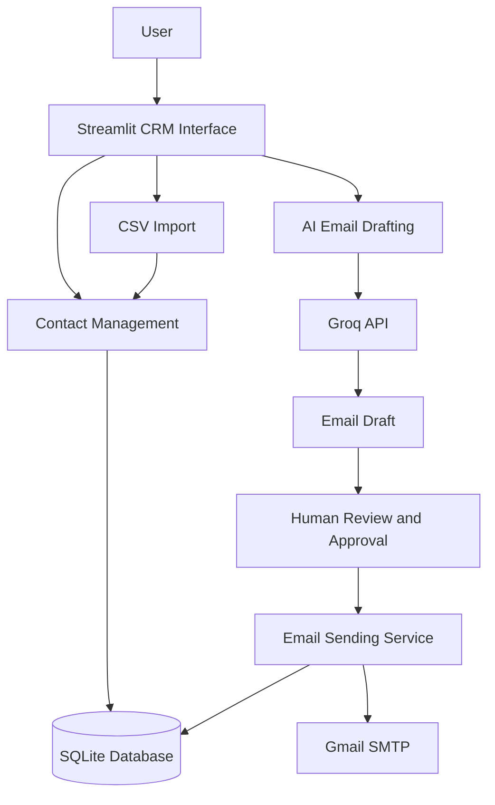

# 📈 IB Networking CRM — AI-Powered Investment Banking Outreach

**A student-friendly CRM for professional networking, AI-assisted email drafting, and outreach management.**

[](https://www.python.org/)
[](https://streamlit.io/)
[](https://www.sqlite.org/)
[](https://groq.com/)
[]()

---

## 🚀 Overview

IB Networking CRM is a Python-based application designed to help students organize professional contacts and manage their networking outreach from one place.

The application brings together contact management, CSV-based contact import, AI-assisted email drafting, human review, and outreach status tracking. It uses Streamlit for the interface, SQLite for local data storage, and the Groq API for AI-generated email drafts.

The goal is to make professional networking more organized while keeping users in control of the messages they send.

### 🎬 Project Demo

Explore the recorded application walkthrough:

**[▶️ Watch the IB Networking CRM Demo](docs/demo.mp4)**

The demo file is stored in the repository's `docs/` directory.

### 🎯 Key Highlights

* Contact management and organization
* CSV contact import
* AI-assisted networking email generation
* Human-in-the-loop draft review and approval
* Email workflow with dry-run testing
* SQLite-based local persistence
* Optional email discovery integration
* Environment-based configuration for API credentials

---

## ✨ Features

### 👥 1. Contact Management

* Maintain professional contact records.
* Organize contacts for networking outreach.
* Import contacts from supported CSV files.
* Store application data using SQLite.

### 🤖 2. AI-Assisted Email Drafting

* Generate networking email drafts using the Groq API.
* Use configured student information to personalize prompts.
* Reduce repetitive email-writing effort.
* Review and edit generated content before using it.

> AI-generated messages can contain incorrect or irrelevant information. Always verify the content before sending.

### ✅ 3. Human-in-the-Loop Approval

The workflow separates AI generation from email delivery.

1. Select a contact.
2. Generate an email draft.
3. Review and edit the draft.
4. Approve the message.
5. Send only after checking the recipient and configuration.

### 📊 4. Outreach Workflow

The application is designed around a simple outreach lifecycle:

`New → Drafted → Approved → Sent`

The workflow helps users organize their outreach activities and track message status.

### 📧 5. Email Integration

* Gmail SMTP-based email delivery.
* Configurable email credentials.
* Dry-run testing before live delivery.
* User review before sending.

Live email functionality depends on the implementation, valid credentials, and provider permissions.

### 📂 6. CSV Import

Import contacts from supported CSV files instead of entering every record manually. Use the column format expected by the application.

### 🔎 7. Optional Email Discovery

The project includes an email discovery service intended for optional Hunter.io integration. Usage requires the appropriate API credentials and provider access.

### 🔐 8. Configuration and Security

* Environment-based application configuration.
* `.env.example` for configuration templates.
* `.env` excluded from version control.
* Local SQLite database for the MVP.

Never place real API keys, email passwords, or private contact data in a public repository.

---

## 🏗️ System Architecture



### Architecture Components

| Component             | Responsibility                  |
| --------------------- | ------------------------------- |
| Streamlit             | User interface and CRM workflow |
| Python                | Application logic               |
| SQLite                | Local data persistence          |
| Groq API              | AI-assisted email drafting      |
| Email service         | Email sending workflow          |
| CSV                   | Contact import                  |
| Environment variables | Application configuration       |

The diagram represents the intended application workflow. Verify each integration against the current implementation before treating it as production-tested.

---

## 🛠️ Technology Stack

| Technology     | Purpose                            |
| -------------- | ---------------------------------- |
| Python 3.10+   | Core application development       |
| Streamlit      | Interactive user interface         |
| SQLite         | Local database                     |
| Groq API       | LLM-powered email drafting         |
| Gmail SMTP     | Email delivery                     |
| CSV            | Contact data import                |
| Conda          | Python environment management      |
| Git and GitHub | Version control and source hosting |

---

## 📁 Project Structure

```text
ib_crm_mvp/
│
├── app.py
├── requirements.txt
├── README.md
├── .gitignore
├── .env.example
│
├── config/
│   └── settings.py
│
├── database/
│   └── db.py
│
├── services/
│   ├── llm_drafter.py
│   ├── email_finder.py
│   └── email_sender.py
│
├── pages/
├── utils/
├── docs/
│   └── demo.mp4
│
└── data/
```

**Note:** This tree summarizes the main project layout. Additional files may exist in the actual repository.

### Important Modules

| File or Directory          | Purpose                                |
| -------------------------- | -------------------------------------- |
| `app.py`                   | Main Streamlit application             |
| `config/settings.py`       | Application settings and configuration |
| `database/db.py`           | Database operations                    |
| `services/llm_drafter.py`  | AI-assisted email drafting             |
| `services/email_finder.py` | Optional email discovery               |
| `services/email_sender.py` | Email sending workflow                 |
| `pages/`                   | Additional Streamlit pages             |
| `utils/`                   | Shared utility functions               |
| `docs/demo.mp4`            | Recorded project demonstration         |
| `requirements.txt`         | Python dependencies                    |
| `.env.example`             | Example environment configuration      |
| `.gitignore`               | Files excluded from Git                |

---

## ⚙️ Getting Started

Follow these steps to run the project locally.

### Prerequisites

* Python 3.10 or a compatible version
* Conda or another Python environment manager
* Git
* Groq API key for AI-assisted drafting
* Gmail SMTP credentials if you intend to test live email delivery
* Hunter.io API key if you use the optional email discovery integration

### 1. Clone the Repository

```bash
git clone https://github.com/vaibhav07772/ib_crm_mvp.git
cd ib_crm_mvp
```

### 2. Create a Conda Environment

```bash
conda create -n ib_networking python=3.10 -y
conda activate ib_networking
```

### 3. Install Dependencies

```bash
python -m pip install -r requirements.txt
```

### 4. Configure Environment Variables

On Windows Command Prompt:

```bat
copy .env.example .env
```

Open `.env` in your editor and configure the values required by the application.

Example configuration:

```dotenv
GROQ_API_KEY=your_groq_api_key

HUNTER_API_KEY=your_hunter_api_key

SMTP_EMAIL=your_email@gmail.com
SMTP_APP_PASSWORD=your_google_app_password

STUDENT_NAME=Your Name
STUDENT_UNIVERSITY=Your University
STUDENT_MAJOR=Finance
STUDENT_GRADUATION_YEAR=2027
STUDENT_LINKEDIN=https://www.linkedin.com/in/yourprofile
STUDENT_EMAIL=your_email@gmail.com
```

Replace all example values with your own configuration. Leave optional credentials unused if their integrations are not needed.

**Important:** These variable names are examples based on the documented configuration. Confirm that they match the names read by `config/settings.py` and the relevant service modules. Do not commit your real `.env` file.

For Gmail, use an appropriate Google App Password where required, rather than your regular account password.

### 5. Run the Application

```bash
streamlit run app.py
```

Open the local URL printed in the terminal. Streamlit commonly uses:

```text
http://localhost:8501
```

---

## 📖 How to Use

The intended workflow is:

1. **Manage contacts:** Add contacts or import a supported CSV file.
2. **Select a contact:** Choose the person for your networking outreach.
3. **Generate a draft:** Use the AI email drafting functionality.
4. **Review the message:** Verify names, facts, tone, and personalization.
5. **Approve the draft:** Confirm the content and recipient before proceeding.
6. **Test safely:** Use dry-run mode while validating the email workflow.
7. **Send when ready:** Use live delivery only after confirming SMTP configuration and the sending behavior.
8. **Track outreach:** Use the available status tracking to organize your activities.

The exact controls and available actions depend on the current application implementation.

---

## 🛡️ Security and Responsible Outreach

Security is important when an application handles API credentials, contact information, and email delivery.

Recommended practices:

* Keep `.env` out of version control.
* Use `.env.example` with placeholders only.
* Never expose API keys or SMTP passwords in screenshots or logs.
* Verify recipients and message content before sending.
* Test the sending workflow in dry-run mode.
* Respect recipients' privacy and opt-out requests.
* Follow email provider rules and applicable privacy requirements.
* Avoid unsolicited bulk outreach.
* Restrict access to local databases containing private contact information.

Human approval is a useful safeguard, but it does not guarantee email deliverability or account safety.

---

## ⚠️ Current Limitations

This project is an MVP intended for learning and individual use, not a fully production-hardened CRM.

* SQLite is suitable for a lightweight local application but may not be ideal for concurrent multi-user deployment.
* AI drafting depends on external API availability and quotas.
* Live email delivery requires valid SMTP configuration and provider permissions.
* Email discovery depends on optional third-party service access.
* Advanced analytics and follow-up reminders may require further development.
* Authentication and role-based access controls should be considered before multi-user deployment.
* Automated tests and production monitoring should be expanded before relying on the application in a business environment.

---

## 🗺️ Future Improvements

Potential next steps include:

* [ ] Automated tests for core workflows
* [ ] Contact validation and duplicate detection
* [ ] Follow-up reminders and activity history
* [ ] Improved error handling and retry logic
* [ ] Better reporting and outreach analytics
* [ ] FastAPI backend for separating application logic
* [ ] PostgreSQL for shared multi-user storage
* [ ] Authentication and role-based access control
* [ ] Structured logging and monitoring
* [ ] Deployment configuration and operational safeguards

These are proposed improvements, not claims that the features are already implemented.

---

## 🧠 AI Engineering Concepts

This project provides practical exposure to several AI application development concepts.

### LLM API Integration

Connecting an external language model service to a Python application.

### Prompt Engineering

Structuring model inputs to generate relevant email drafts from user-provided context.

### Human-in-the-Loop AI

Placing a human review step before AI-generated content triggers an external action.

### Workflow Automation

Connecting contact management, drafting, approval, and email delivery into a structured process.

### Data Persistence

Using SQLite to store application data locally.

### External Service Integration

Working with an LLM API and an email service, with optional email discovery.

### Configuration and Secrets Management

Separating credentials and environment-specific settings from application code.

---

## 🎤 Interview Talking Points

**1. What problem does this project solve?**

It brings contact management, AI-assisted networking email drafting, and outreach tracking into a single application for students.

**2. Why use an LLM for email drafting?**

An LLM can create contextual draft messages from supplied information, reducing repetitive writing while allowing the user to review and edit the output.

**3. Why use SQLite?**

SQLite is lightweight and does not require a separate database server, making it appropriate for a local MVP. PostgreSQL could be considered for a larger multi-user deployment.

**4. Why include human approval?**

AI-generated content can be inaccurate. Human review helps verify the message and recipient before an external action such as sending an email.

**5. Why use dry-run testing?**

Dry-run testing helps validate the sending workflow without intentionally delivering real emails, provided the implementation correctly enforces dry-run behavior.

**6. How could the system be scaled?**

A future version could separate the frontend from a FastAPI backend, use PostgreSQL for shared storage, introduce authentication and authorization, and add automated tests and monitoring.

**7. What would you improve next?**

I would prioritize testing, contact deduplication, reliable error handling, follow-up reminders, secure multi-user access, and better outreach reporting.

---

## 🤝 Contributing

Suggestions and contributions are welcome.

1. Fork the repository.
2. Create a feature branch.
3. Make your changes.
4. Test the affected functionality.
5. Commit your changes with a descriptive message.
6. Open a pull request describing the changes.

Do not include real credentials or private contact data in contributions.

---

## 👨‍💻 Author

**Vaibhav Singh**

Student Developer | AI Engineering, Automation & Finance Technology

* **GitHub:** [@vaibhav07772](https://github.com/vaibhav07772)
* **Project Repository:** [ib_crm_mvp](https://github.com/vaibhav07772/ib_crm_mvp)

---

⭐ If you find this project useful, consider starring the repository.

**Built to make professional networking more organized, personalized, and user-controlled.**
